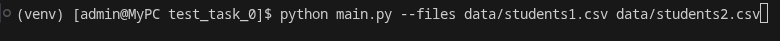
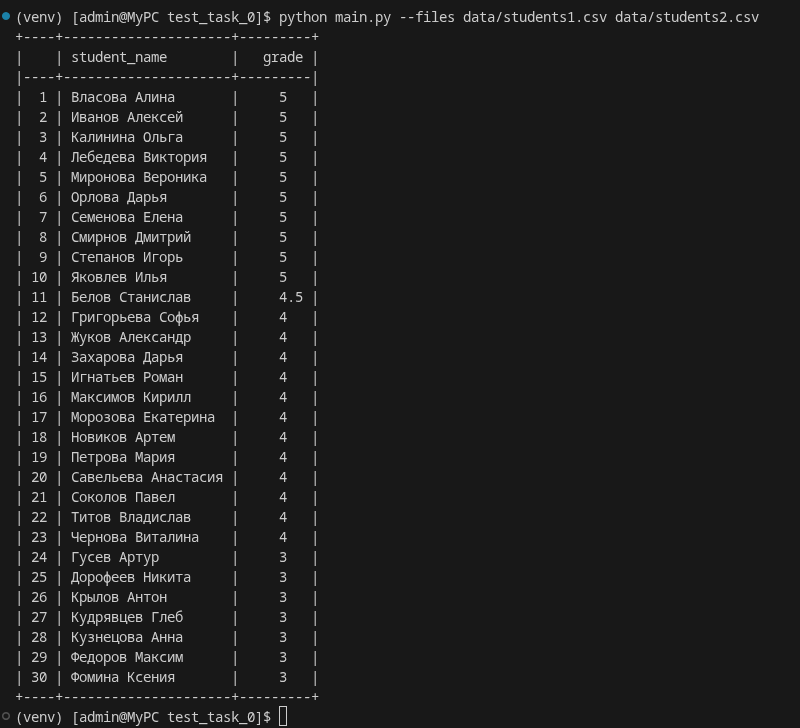
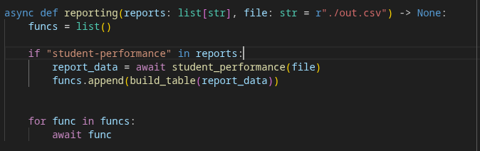

# test_task_0 \
## Запуск программы \
Запуск программы требует виртуального окружения. \
Зависимости находятся в файле "requirements.txt". \
Для запуска необходимо в коммандной строке, находясь в директории проекта, прописать "python main.py --files [пути до csv-файлов через пробел] --reports [названия отчетов через пробел]" по умолчанию выбран отчет "student-performance". \
Запуск скрипта: \
 \
Результат выполнения: \
 \

## Добавление отчетов \
Чтобы добавить новый отчет, необходимо написать функцию формирования отчета в "./function/reports.py". \
Когда функция для отчета написана, нужно получить из нее данные и вывести на экран. Для этого ее нужно добавить в логику обработчика аналогично функции "student-performance". \
 \